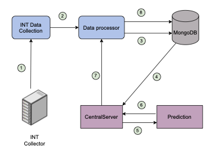
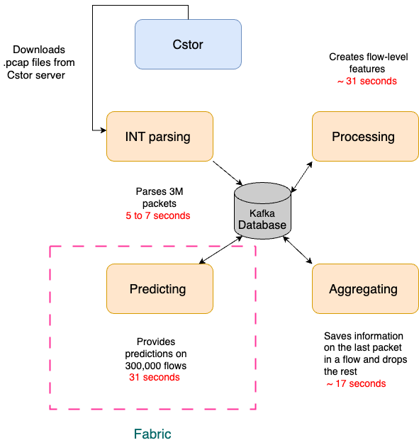
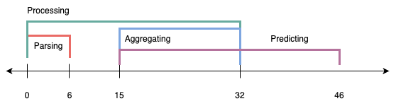

# Leveraging In-band Network Telemetry for Automated DDoS Detection in Production Networks
## Introduction

Programmable data planes have significantly enhanced the flexibility to define the behaviors of packet forwarding switches, routers, and network interface cards (NICs). In-band Network Telemetry (INT) technology has further empowered network operators to manage packet flows by enabling real-time and customizable packet monitoring with minimal network overhead. These advancements in networking technology have sparked considerable research interest and activity, including studies on INT-based DDoS detection and mitigation mechanisms. However, in practice, the full potential of INT technology, particularly for real-time network anomaly detection, remains unrealized. While some research utilizes INT for DDoS detection, the data used are typically generated in simulated or testbed environments. In this project, we will utilize INT data from a production network. The proposed mechanism will be capable of handling production-level volume and speed while providing timely DDoS attack detection. 

## Background 

### The Intrusion Detection System (IDS)

Intrusion Detection Systems (IDS) are critical defense and security mechanisms that monitor and analyze network traffic to identify unusual or potentially malicious activities within a network. In terms of utilized detection techniques these systems can be broadly classified into three categories: signature-based, anomaly-based and hybrid techniques.

The signature-based technique relies on the careful analysis and recording of previous malicious activities[1]. Once sources of malicious activities are well-established and the patterns are recognized, they are used to identify, block, and eliminate similar malicious flows. This method is highly accurate for detecting known threats. However, it is less effective against new or unknown threats and requires constant updates to maintain its effectiveness.

In anomaly-based techniques, normal and expected behavior of a network is defined based on historical network traffic data. This network profile is then used to manage flows and identify abnormal behavior. Based on this technique, an IDS can perform well against unseen threats; however, it is prone to false alarms as network behavior can show quite varying patterns, which could make it difficult to capture all normal flow behaviors[1].

Finally, the hybrid techniques combine and exploit the strengths of both methods to provide a more robust defense against intrusions. For instance, one way to combine these methods is to use threat records to identify abnormal behavior, and thus recognize normal patterns in a network[1].

IDS is a general term for all defense mechanisms against intrusions. In this paper, we implement an anomaly-based technique and utilize machine learning models to differentiate normal flows from malicious behavior and detect DDoS threats. Therefore, we will specifically refer to DDoS detection systems rather than using the general term IDS.

## Related Work
## Proposed Automated DDoS Detection Mechanism

The figure below illustrates the proof-of-concept mechanism for DDoS attack detection, which served as the foundation for the first paper produced in this project. Building on this initial work, we are enhancing the mechanism to effectively handle the speed and volume demands of a production network.

The mechanism includes four modules, and the functions each module perform are as follows:
- This module gathers INT data from the INT Collector. It primarily runs a Python script that extracts the INT telemetry header, metadata, and IP header information (1). The collected data is then sent to the Data Processor module (2).
- Data Processor: This module processes packet-level INT data using a JavaScript script. It calculates packet-level metrics, such as inter-arrival time, by taking the difference between consecutive ingress timestamps. It also creates flow-level features based on the Flow ID. After processing, the data is sent to a database for storage (3). Additionally, the module receives predictions from machine learning (ML) models via the CentralServer (7), aggregates these predictions into a single prediction label, and stores them in the database along with the corresponding timestamp and prediction latency, measured as the difference between the prediction time and the packet’s registration time (8).
- This module continuously communicates with the database to check for updates in the records (4). When updates are detected, it forwards the information to the Prediction module (5). It also listens for predictions from the Prediction module and retrieves them when available (6), subsequently sending these predictions to the Data Processor module for aggregation (7).
- This module generates ML-based predictions. Upon initialization, it loads pre-trained ML models and the coefficients of the scaler transformation, used to standardize feature values to unit variance. The module receives updated packet- and flow-level data from the CentralServer (5), standardizes the new feature set, and feeds it into the pre-trained models for prediction. The resulting predictions are retrieved by the CentralServer (6).

## Experimental Evaluation

## $${\color{blue} Research \space Highlights \space Timeline}$$	

In this section, we report the important highlights of the research on DDoS detection.

### January 3, 2024

The research on DDoS detection mechanisms began in January 2024. The goal was to create an ML-based intrusion detection mechanism leveraging INT data to detect DDoS threats in the AmLight production network. A Python-based system was developed and implemented on a dedicated testbed, providing accurate threat detection. This work culminated in a publication submitted to a conference on August 15, 2024.

### August 15, 2024

The aforementioned DDoS detection mechanism was primarily developed using a Python script that parsed INT data, processed it for flow and packet-level features, and fed it into a machine learning script for predictions. We utilized JavaScript for the web server script and MongoDB for data storage. Although this proof-of-concept mechanism successfully leveraged INT data for DDoS threat detection, it was not designed to handle production-level speed and volume. The experiments were conducted at a maximum speed of 100 packets per second (pps) to ensure optimal processing; higher speeds resulted in data loss. Therefore, the next goal for the project was to enhance its performance to address production-level data volume and speed.

### September 4, 2024 

A detailed examination of the script concluded that it spends most of its time on Network I/O operations, including queuing, retrieving, and storing data, waiting for child processes to finish, and performing iterations, data reading, and writing. To optimize the DDoS detection mechanism, the research team decided to use eBPF for parsing pcap files containing INT data, C/C++ for other tasks, and Kafka for data storage.

### September 18, 2024

We successfully completed the task of parsing INT data using eBPF. To provide perspective, for 3 seconds of production data containing 12,968,765 packets, eBPF/XDP was able to extract all packet information in about 7.9 seconds, while a similar Python script managed to extract only 77,531 packets.

In AmLight we already store INT data with Cstor Cpack tool. Therefore, we decided to download the INT data from Cstor, rather than reading them directly live from the network. Thus we decided not to pursue the eBPF path. 

### November 18, 2024

The paper was accepted and presented at the Innovating the Network for Data-Intensive Science (INDIS) Workshop during the Supercomputing Conference on November 18, 2024.
[Link to the paper](https://conferences.computer.org/sc-wpub/pdfs/SC-W2024-6oZmigAQfgJ1GhPL0yE3pS/555400a793/555400a793.pdf)

### December 18, 2024

We improved our DDoS detection mechanism to process and provide predictions on production data in under 1 minute. We retained the core structure from our proof-of-concept mechanism but implemented C/C++ scripts to handle INT data parsing, processing, and aggregation tasks. We continued to use Python scripts for ML predictions and also utilized GPUs to accelerate ML prediction tasks. Additionally, we used Kafka for storage, as it is well-suited for handling large volumes of streaming data. Below is a sketch of the mechanism, including the associated processing times for each script with 3 million packets.

In the above figure, we presented the time required to process each script. However, some tasks can be run simultaneously, reducing the total processing time to under one minute. Please see the figure below for the timeline of the entire process.

## References
[1] G. Fernandes, J. J. Rodrigues, L. F. Carvalho, J. F. Al-Muhtadi, and M. L. Proen c¸ a, “A comprehensive survey on network anomaly detection,”Telecommunication Systems, vol. 70, pp. 447–489, 2019.

 
