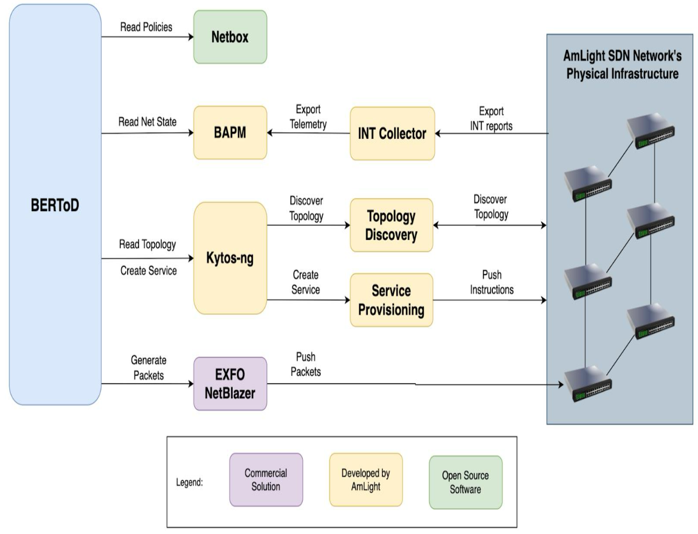
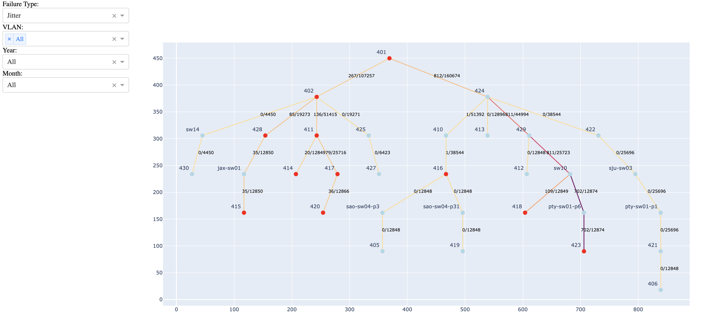

### BERToD: An automated BER testing framework to detect packet QoS Failures at AmLight

This project aims to create an automated testing tool to check all possible links on Amlight network for QoS failures such as frame loss, jitter, out-of-sequence packets, and latency. In its final version, the tool will gather data from Netbox about network policies, from BAPM In-band network telemetry data, from Kytso-ng about the network topology, and send testing packets using EXFO NetBlazer. The goal is to observe failures in the network, to isolate the link that causes the problem, to identify the issue, and to remedy the problem. The test will run continuously and evaluate the network status to proactively address potential issues. See below figure for the visualization of the BertoD tool.

We sent packets using the EXFO NetBlazer and measured the following:

- Failures: Jitter, latency, out-of-sequence packets, and frame loss
- Packet Properties:
  - Frame size: Mixed (68, 256, 512, 10124, 1518) or fixed (9000) bytes
  - Duration
  - Number of packets sent

### January 9, 2025

The test from BERToD produced over 400,000 rows of data, including the frame size (68, 256, 512, 1024, 1518, 9000 bytes), the duration of each test run, and the total number of frames/packets sent. I also incorporated data for all the links through which the test packets were sent. For example, a link between VLANs 410 and 416 is labeled as "410_416" and is coded as 1 if the packets pass through this link and 0 otherwise. I first mapped all the network links as a tree (see the figure below). Then, I ran logistic regression and Neural Network ML models, using failures as the outcome variable and all other variables, including the links, as features.

### February 12, 2025

We read the network topology using EVC from Kytos-ng and combined it with test results obtained from the EXFO NetBlazer. We utilize statistical models and machine learning to identify the links responsible for failures. For the statistical analyses, we created variables for each link, assigning a value of 1 if a packet passes through that link for a given VLAN and 0 otherwise. Additionally, we introduced a counter variable to track link usage in 30-minute intervals. The statistical tests revealed some unexpected results regarding the most problematic links. Consequently, we decided to take a closer look at the data and analyze certain failure cases individually.

[Presentation document](https://drive.google.com/file/d/1-fJsfu4RRns1BVTTt6VBUsATix1jreD-/view?usp=sharing)

### February 19, 2025

We analyzed the VLANs with the highest failure rates to gain a better understanding of the problem. Specifically, we examined the correlation between different failure types.

First, both frame loss and latency exhibited a strong correlation with their lagged versions (lagged by 1, 2, and 3 timestamps). Jitter and out-of-sequence errors also showed strong correlations with past occurrences, but they skipped one lagged variable. For instance, jitter at the current timestamp correlated with jitter from two timestamps prior but not with the immediate previous timestamp.

Second, when examining individual VLANs, we observed varying levels of correlation across different failure types. Thus, there is no single pattern, suggesting that although the failure types appear similar, their underlying causes may differ.

Third, we analyzed the time series of failures to understand how they are associated over time. While we observed some correlations in certain VLANs, this was not consistent across all cases.

Next, we examined branches with multiple segments to assess whether a failure in one branch affected failures in another. We found no strong correlation, indicating that failures in each branch are largely independent of one another.

Finally, we began analyzing VLANs that start with "5." However, we encountered difficulties in constructing the topology, making our analysis less conclusive. Nevertheless, the results were similar to those observed in VLANs that start with "4."

We will continue investigating failure cases individually. Additionally, we plan to incorporate more information and leverage INT data to better identify the problematic links.

[Presentation document](https://drive.google.com/file/d/1GdEWWvtaJrMdNYTTH2tXOVOYnmLOWoy8/view?usp=sharing)

