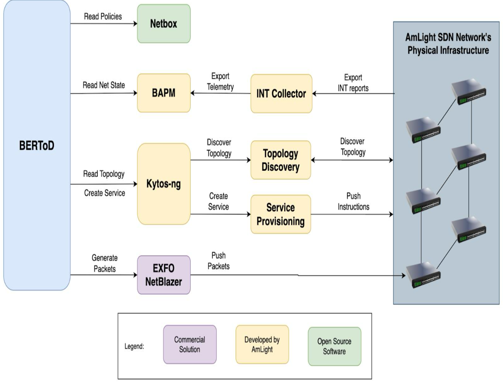

### BERToD: An automated BER testing framework to detect packet QoS Failures at AmLight

This project aims to create an automated testing tool to check all possible links on Amlight network for QoS failures such as frame loss, jitter, out-of-sequence packets, and latency. In its final version, the tool will gather data from Netbox about network policies, from BAPM test reports, from Kytso-ng about the network topology, and send testing packets using EXFO NetBlazer. The goal is to observe failures in the network, to isolate the link that causes the problem, to identify the issue, and to remedy the problem. The test will run continuously and evaluate the network status to proactively address potential issues. See below figure for the visualization of the BertoD tool.

